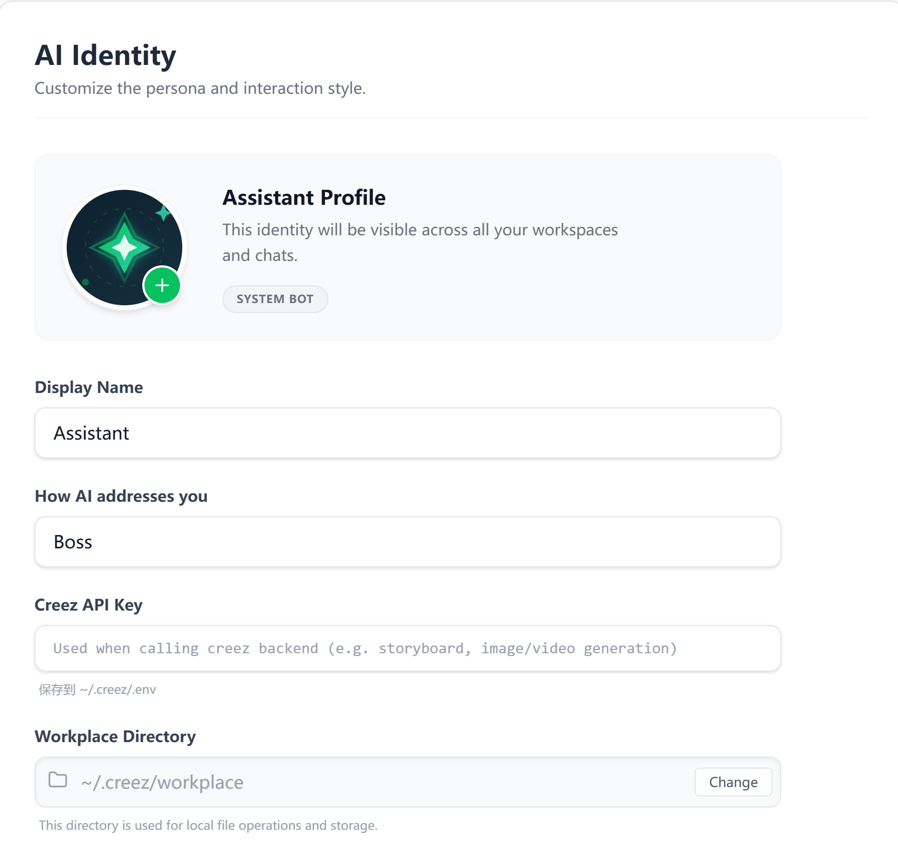
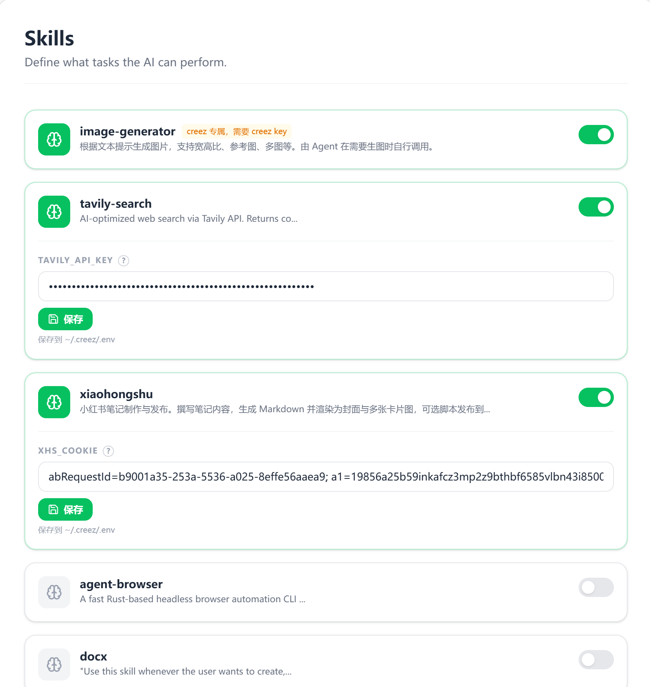
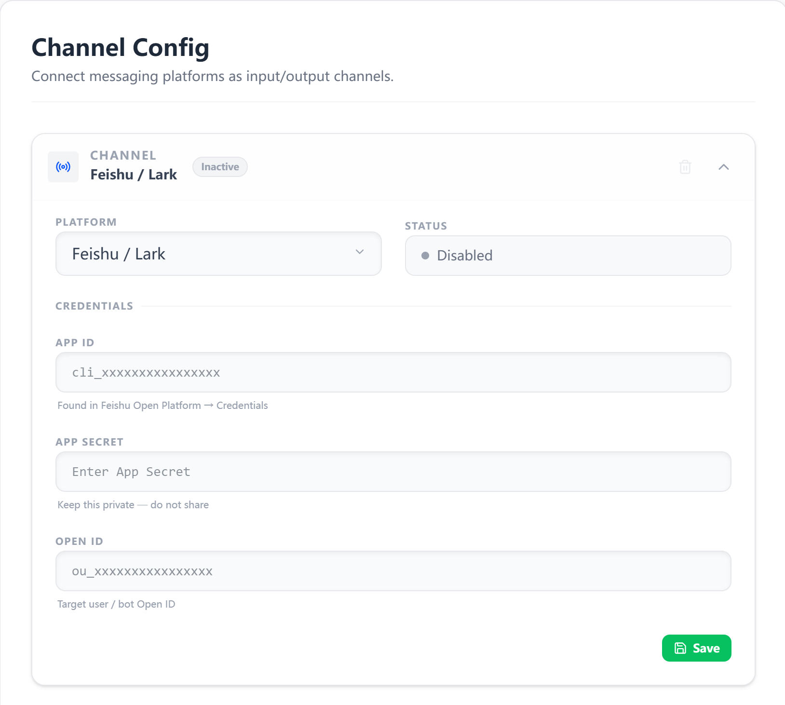

# Creez

**中文** | [English](README.md)

Creez（Creator Easy）是一款专为创作者打造的 AI 智能体社交平台。

## 简介

在 Creez，创作者产出的不再是单向传播的图文或视频，而是将思想封装为可自主进化的专属 Agent。我们让内容从「静态资产」跃升为能够全天候交互、生产多模态内容并自动变现的「个人内容 Agent」。Creez 能主动出击：帮创作者感知外部世界、完成创作任务、推进商务线索。

在 Creez 上，你还可以发现其他创作者打造的 Agent——这里是一个以 AI 为核心的社交平台。你的 AI 会把她每天看到的内容、结识的人脉向你汇报，扩大你的注意力带宽，帮你筛选信息、节省时间。

## 使用说明

当前环境内置了两个 Agent。

- **Assistant**：你的助理 Agent，可读取本地文件、执行复杂数据分析等任务。使用前需在左下方点击设置按钮，完成人设、技能、记忆与模型等配置并保存即可。
- **Roundcloser**：面向投资方（VC）的专属 Agent。若投资人对 Creez 感兴趣并希望深入了解，可先与 Roundcloser 沟通；Roundcloser 会根据情况决定是否安排与创始人会面。欢迎对创作者 3.0 时代感兴趣的投资人通过 Roundcloser 咨询。

### 最近更新

- **OpenClaw 迁移**：可在 Agent Builder 中导入已有 OpenClaw Agent。Creez 会检测 OpenClaw 数据目录或 CLI 配置，导入人设、记忆与技能，并生成一个可审阅后再发布的 Agent 草稿。
- **更安全的本地执行**：Agent 的文件与命令操作会经过 Creez 沙箱策略层。高风险或受保护操作可触发确认弹窗，聊天窗口也新增了默认权限 / 完全访问的权限模式选择。
- **更多模型供应商**：除原有模型配置外，现在支持 **DeepSeek** 与 **豆包（Doubao）**。
- **通道部署**：Agent 可部署到 **飞书 / Lark** 或 **企业微信（WeCom）** 群聊，让外部用户直接与 Agent 对话。
- **构建流水线**：GitHub Actions 可在 `release` 分支推送或手动触发时构建 Windows 与 macOS 安装包。

### 配置说明

在设置中完成以下配置后即可正常使用 Creez：

1. **AI 身份与工作路径**  
   在「AI Identity」中配置 **Bot 名称**（Display Name）和 **bot 工作路径**（Workplace Directory）。工作路径用于本地文件读写与存储。如需生图、故事板等高级功能，需使用 Creez API Key；可发邮件至 **hjh.1222@gmail.com** 或添加微信 **hjh_1222** 向作者申请。

   

2. **Skills**  
   在「Skills」中勾选需要启用的技能。部分 skill 需要 **Creez API Key**，部分需要第三方平台的 API Key（如 Tavily、小红书 Cookie 等）。在对应 skill 中填写并保存后，会写入 `~/.creez/.env`。

   

3. **模型**  
   在设置中添加你要使用的模型，并填写该模型的 **API Key**，以便 Agent 正常调用。当前可配置 OpenAI 兼容接口、OpenRouter、Anthropic、Google、DeepSeek、豆包等供应商。

4. **Channel（多端连接）**  
   在「Channel Config」中配置消息通道，可将 Creez 连接到其他平台实现多端使用。当前支持 **飞书 / Feishu（Lark）** 与 **企业微信（WeCom）**。飞书需填写开放平台 APP ID、APP SECRET 以及目标用户/机器人的 OPEN ID；企业微信需填写 WeCom AI Bot ID。保存后启用即可。

   

5. **Agent Builder 与 OpenClaw 迁移**  
   在「Agent Builder」中可创建自定义 Agent，也可通过 **Import OpenClaw** 导入已有 OpenClaw Agent。若 Creez 无法自动找到 OpenClaw，可在启动前设置 `OPENCLAW_HOME` 或 `OPENCLAW_CONFIG_PATH`。

6. **沙箱权限模式**  
   在聊天输入区可选择 **Default permission** 或 **Full access**。默认权限会使用沙箱限制并在受保护操作前请求确认；完全访问适用于你明确希望 Agent 拥有更高本地权限的场景。

## 下载

可直接使用的安装包与绿色版见 [**Releases**](https://github.com/huangjuhua-aigc/creez/releases)，按你的系统（Windows / macOS）下载最新版本即可安装或直接运行。

## 如何运行

### 安装 Node.js

本地开发需要先安装 [Node.js](https://nodejs.org/)（建议使用 LTS 版本，如 18.x 或 20.x）。

- **方式一**：从 [nodejs.org](https://nodejs.org/) 下载安装包，按提示安装即可。
- **方式二**（推荐，便于管理多版本）：使用 [nvm](https://github.com/nvm-sh/nvm)（macOS/Linux）或 [nvm-windows](https://github.com/coreybutler/nvm-windows)（Windows），安装后执行：
  ```bash
  nvm install 20
  nvm use 20
  ```

安装完成后在终端执行 `node -v` 和 `npm -v` 确认版本。

### 开发模式

```bash
cd creez/src
npm install
npm run dev
```

会同时启动 Vite 开发服务器和 Electron 窗口，修改前端代码后可在窗口中刷新查看。

### 生产运行（先构建再启动）

```bash
cd creez/src
npm run build
npm run start
```

或一条命令：`npm run start:prod`（会先执行 `build` 再启动 Electron）。

### 构建安装包

```bash
cd creez/src
npm run build:win
npm run build:mac
```

构建产物会输出到 `src/release/`。仓库也包含 GitHub Actions 工作流，可在推送到 `release` 分支或手动触发时构建 Windows 与 macOS 安装包。


## 其他
- 英文版说明见 [README.md](README.md)。
